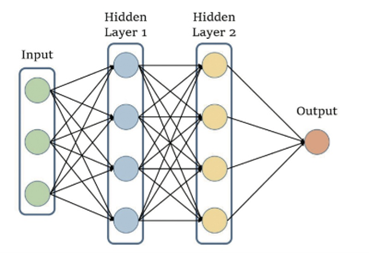
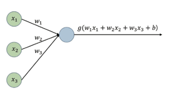

> AI-X: Deep Learning 최종 그룹 프로젝트  
> * Title: DQN with a 2D particle survival game   
> * Members: 기계공학 2017035787 채민호 / 전기공학 2016026608 강민지

 
DQN wiht a 2D particle survival game  
=====================================
이번 프로젝트에서는 DQN이 무엇인지 알아보고, 이를 실제로 2D particle survival game에 적용해본다. 2D particle survival game environment는 다음과 같은 성질을 갖으며 [Karpathy's Waterworld environment](https://cs.stanford.edu/people/karpathy/reinforcejs/waterworld.html)를 참고하였다.
* Deep RL agents to learn to stay alive as long as possible via avoiding collisions with obstacles.  
* DQN agent implementation is provided for immediate usage.  
* The agent reawrd scheme is +1 for each time step alive, and -100 for obstacle collision.  
* The episode termination condition in agent collision with any obstacles.  
  
1.이론적 배경: Q-Learning 
---------------------------

2.Deep RL
----------
#### RL의 한계와 Deep RL의 등장
RL(강화학습)은 Markov Decision Process(MDP) 문제를 푸는 것이다. MDP란 기존의 Markov Process (MP, Markov Chain, 시간 간격이 이산적이고 현재의 state가 이전 state에만 영향을 받는 확률 과정)에 Action과 Policy가 추가된 것을 의미한다. 그러나 보통의 경우 State의 개수가 무수히 많은 커다란 MDP를 많이 마주하게 된다. 이러한 커다란 문제 공간을 효율적으로 다루기 위해 함수를 활용한 Neural Net, Deep Learning이 등장하였다. 즉 딥러닝과 강화 학습이 결합된 Deep RL이 세상에 알려지게 된다.
간단한 MDP의 경우 주로 테이블 기반 방법론(tabular method)으로 문제를 해결한다. 테이블 기반 방법론이란 모든 상태 s 혹은 상태와 액션의 페어 (s,a)에 대한 테이블을 만들어서 값을 기록해 놓고, 그 값을 조금씩 업데이트하는 방식을 의미한다. 즉 상태 s마다 그에 해당하는 value를 적어 놓기 위해, 총 상태의 개수만큼 테이블이 커져야 한다. 그런데 상태의 개수가 너무 많을 때는 다음과 같은 현상이 일어난다. 
> 예를 들어 바둑판은 19\times19 격자로 이루어져 있고 한 알만 더 놓여져도 이전과는 전혀 다른 고유한 상태가 된다. 이를 바탕으로 바둑의 고유한 상태의 수를 어림하여 세어보면 10^170^의 상태가 존재함을 확인할 수 있다. 이처럼 상태의 개수가 무수히 혹은 무한히 많아지면 테이블 방식의 접근 법으로는 대처할 수가 없다. 물리적으로 테이블을 만들 수가 없기 때문이다. 테이블이라는 것은 결국 컴퓨터의 어딘가에 저장되어 있어야 할 텐데, 10^170^B를 저장할 수 있는 컴퓨터는 이 세상 어디에도 없기 때문이다. 컴퓨터 한 개를 1TB(=10^12^B)라고 한다면 컴퓨터가 10^158^대가 있어야 저장할 수 있을 것이다. 또한 컴퓨터의 저장 용량이 비약적으로 발전해 10^170^B를 저장할 수 있다고 가정해도, 10^170^개의 상태를 모두 방문해 보아야하기 때문에 그래도 학습은 불가능할 것이다. 테이블 기반 방법론에서는 각각의 데이터 (s,a,r,s^\prime^)가 그에 해당하는 딱 한 칸의 값만 업데이트하며, 주변의 다른 칸의 값에는 전혀 영향을 주지 않는다. 따라서 모든 칸의 값을 업데이트하려면 결국 모든 칸을 다 방문해야 한다. 더욱이 체스나 바둑처럼 이산적인 것이 아닌 연속적인 속도 정보를 이용한 연속적인 상태 공간에서 테이블을 만들기란 불가능하다.  
### Neural Network
이를 해결하기 위해 새로운 접근법은 함수이다. 가치함수 v(s)를 모사하는 함수 f를 만들어 학습시키는 것이다. 함수는 이미 경험한 데이터를 바탕으로 경험하지 않은 데이터의 아웃풋을 예상하는데 뛰어나다. 새로운 데이터가 들어오면 기존 데이터를 바탕으로 학습되었던 f에 넣어주기만 하면 된다. 이를 통해 기존 테이블 기반 방법론과 달리 무수히 많은 저장용량을 필요로 하지 않게 된다.  
그 후에 어떤 함수를 사용할 것인가에 대한 고민이 남게 된다. 현대의 강화 학습에서 그 답은 “인공 신경망(Artificial Neural Network)”이다. 뉴럴넷의 본질은 매우 유연한 함수이다. 함수에 포함된 프리 파라미터를 이용하여 세상의 어떠한 복잡한 관계도 피팅할 수 있게 해준다. 1차함수의 경우 프리 파라미터가 2개, 16차 함수의 경우 17개이다. 그러나 웬만한 신경망은 프리 파라미터가 100만 개를 넘어간다.  
  
위 그림은 인경신경망 개요도로, 가장 전형적이고 간단한 신경망의 예시이다. 이 신경망은 길이가 3인 벡터를 인풋으로 받아 값 하나를 리턴하는 함수이다. 함수 안에는 히든 레어이가 두 층이 쌓여 있다. 그리고 각각의 히든 레이어는 4개의 노드로 구성되어 있다. 다시 말해 신경망은 히든 레이어로 구성되어 있고, 히든 레이어는 노드로 구성되어 있으므로 결국 노드가 신경망의 기본 구성 단위이다. 노드는 해당 노드로 들어오는 값을 선형 결합(linear combination)한 후에 비선형 함수(non-linear activation)를 적용한다. 하나의 노드를 떼어서 더욱 구체적으로 살펴보자.   
  
위의 그림은 첫번째 히든 레이어 있는 하나의 노드를 떼어서 그림을 그려본 것이다. 그림과 같이 해당 노드로 들어오는 3개의 값(x~1~,x~2~,x~3~)을 선형 결합하여 w~1~x~1~+w~2~x~2~+w~3~x~3~+b를 만든 후에 이 값에 g(x)라는 비선형 함수를 통과시킨다. 뉴럴넷에서는 RELU(Rectified Linear Unit)와 같은 여러가지의 비선형 함수들을 사용한다. 여기서 선형 결합은 새로운 피쳐(feature)를 만드는 과정이다. 예를 들어 체스를 두는 에이전트를 학습하려는데 현재 상태 벡터 s가 살아 있는 (룩의 수, 폰의 수, 비숍의 수)로 표현되어 있다고 가정해보자. 그런데 현재 상태를 평가하는 데에 룩과 폰과 비숍의 개수를 모두 합친 값이 중요하다고 하면 w~1~=w~2~=w~3~=1,\ b=0으로 학습을 시킬 것이다. 즉 이렇게 되면 살아 있는 룩과 폰과 비숍의 수의 합이라는 새로운 피쳐가 탄생한다. 즉 이 피쳐는 인풋 벡터의 피쳐보다 한층 더 추상화된 피쳐로서 학습에 더욱 적절한 값으로 재탄생하게 된다. 두 번째로 비선형 함수는 이풋과 아웃풋의 관계가 비선형 관계일 수 있기 때문에 필요하다. 만일 비선형 함수가 없다면 인풋과 아웃풋 사이 선형 관계만 학습하게 될 텐데, 그렇다면 뉴럴넷의 표현력이 실제 자연과 현실의 많은 문제를 해결하기 힘들 것이다.  
마지막으로 뉴럴넷을 구성하는 파라미터들인 w,b의 값을 찾는 과정인 학습 부분에 대해서 얘기해볼 것이다. 우리는 손실함수를 통하여 뉴럴넷의 아웃풋이 주어진 데이터로부터 틀린 정도를 확인할 수 있다. 그리고 우리의 목표는 손실 함수의 값이 줄어들도록 하는 것이다. 그렇다면 손실함수 L(w)의 값을 계산하는 데에 있어 w가 미치는 영향력을 알아보아야 할 것이다. W를 아주 조금 증가시키거나 감소시켰을 때 함수 L(w)의 값이 어떻게 바뀌는 지를 관찰해 보면 영향력을 알 수 있다. 그리고 이는 L(w)를 w로 미분해보면 그 영향력을 쉽게 알 수 있다. 그리고 수많은 파라미터가 있는 신경망에서는 편미분(partial derivative)를 통해 각각 파라미터의 영향력을 평가하게 된다. 이를 수식으로 표현하면   
\nabla~w~L(w)=(\frac{\partial L\left(w\right)}{\partial w~1~},\frac{\partial L\left(w\right)}{\partial w~2~},\ldots\ ,\frac{\partial L\left(w\right)}{\partial w~n~})  
으로 표현된다. 그리고 우리는 α라는 상수를 통해 얼마나 이동시킬 지 결정한다. α는 업데이트 크기를 결정하는 상수로, 러닝 레이트(learning rate)라고 불러진다. 따라서 그라디언트에 α를 곱하여 원래의 값에 빼주면 우리가 목적 함수를 최소화 해나가는 과정을 수행할 수 있고 이는 그라디언트 디센트 (gradient descent, 경사하강법)이라고 불린다.  
\ast\ast\mathbf{w}^{\prime^\ast}\ast=\ast\ast\mathbit{w}\ast\ast-\alpha\ast\nabla~w~L(w)
  
3.DQN
------
모델 프리 상황에 상태 공간(state space)과 액션 공간(action space)이 매우 커서 밸류를 일일이 테이블에 담지 못하는 상황에서는 본격적으로 뉴럴넷과 강화 학습이 접목한다.  
가치 기반 에이전트는 가치 함수에 근거하여 액션을 선택한다. 모델 프리 상황에서는 v(s)만 가지고 액션을 정할 수 없기 때문에 가치 기반 에이전트는 q(s,a)를 필요로 한다. 상태 s에서 선택할 수 있는 액션들 중에서 가장 밸류가 높은 액션을 선택하는 방식이다. Q러닝의 에이전트는 대표적인 가치 기반 에이전트로, Q러닝을 큰 문제로 확장하여 뉴럴넷을 이용해 최적의 정책을 찾을 수 있다.  
 앞서 보았던 Q러닝은 벨만 최적방정식을 이용해 최적 액션-벨류인〖 Q〗_* (s,a)를 학습하는 것이다. 이때 〖 Q〗_* (s,a)는 테이블에 적혀 있는 값으로, 아래와 같은 테이블 업데이트 수식을 갖고 있었다.   
Q(s,\ a)=\ Q(s,\ a)+\alpha(r+\ \gamma\ \ max\below(a^\prime\ )\funcapply Q(s^\prime,\ a^\prime\ )-Q(s,\ a))   
딥 Q러닝은 Q러닝을 뉴럴넷으로 확장하는 것이다. 테이블 업데이트 식을 보면 정답인 r+ γ  max┬(a^' )⁡Q(s^',a^' )와 현재 추측치인 Q(s,a) 사이 차이를 줄이는 방향으로 업데이트 한다. 뉴럴넷에서도 마찬가지 방식으로 손실 함수를 정의할 수 있다. r+ γ  max┬(a^' )⁡Q(s^',a^' )를 정답으로 보고, 이것과 〖 Q〗_θ (s,a) 사이 차이의 제곱을 손실 함수라 정의하겠다.  
L(θ)= E[〖(r+ γ  max┬(a^' )⁡Q(s^',a^' )-Q(s,a))〗^2 ]  
손실 함수를 정의할 때에는 기댓값 연산자 E가 반드시 필요하다. 같은 상태 s에서 같은 액션 a를 선택한다 하더라도 매번 다른 상태에 도달할 수 있기 때문이다. 물론 실제로 뉴럴넷을 업데이트할 때는 샘플 기반 방법론으로 E를 무시하고 계산할 수 있다. 데이터를 여러 개 모아서 그 평균을 이용해 업데이트하는 것이 그 방법이다. 이런 방식으로 하나의 데이터에 대해 θ를 업데이트하는 식을 적어보면 다음과 같다.  
θ^'= θ+α(r+ γ  max┬(a^' )⁡〖Q_θ (s^',a^' )〗-Q_θ (s,a))∇_θ Q_θ (s,a)    
이 식을 이용하여 θ를 계속해서 업데이트해 나가면 Q_θ (s,a)는 점점 최적의 액션-가치 함수 Q_* (s,a)에 가까워질 것이다.   
