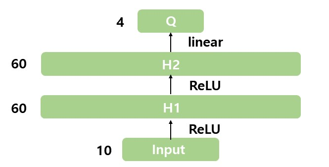

> AI-X: Deep Learning 최종 그룹 프로젝트  
> * Title: DQN with a 2D particle survival game   
> * Members: 기계공학 2017035787 채민호 / 전기공학 2016026608 강민지
> * 
 
DQN wiht a particle survival game  
=====================================
이번 프로젝트에서는 DQN이 무엇인지 알아보고, 이를 실제로 particle survival game에 적용해본다. 이를 위해 우선 DQN의 이론적 배경이 되는 Q-Learing과 Deep RL의 개념을 다룬다. particle survival game environment는 다음과 같은 성질을 갖으며 Anson Wong의 [XY_universe](https://github.com/ankonzoid/XY_universe)를 참고하였다.
* Deep RL agents to learn to stay alive as long as possible via avoiding collisions with obstacles.  
* DQN agent implementation is provided for immediate usage.  
* The agent reawrd scheme is +1 for each time step alive, and -100 for obstacle collision.  
* The episode termination condition in agent collision with any obstacles.   
   
   
   
1.Q-Learning 
------------   
#### 1.1 Q러닝의 이론적 배경 : Temporal Difference
Q러닝은 Temporal Difference를 이용하여 최적의 정책을 찾는 방법을 중 하나이다. 따라서 Q러닝을 알아보기 전에 Temporal Difference에 대한 간략한 소개를 하고 넘어가겠다.    Temporal Difference 방법은 월드에서 한 에피소드가 끝나기 전에 Value 값을 업데이트하고 싶다는 생각에서 시작되었다. 그렇다면 종료하지 않는 MDP (non-ternminating Markov Decision Process)에 대해서도 학습을 진행할 수 있게 된다. 그런데 종료하지 않는 MDP 에서는 리턴이 존재하지 않는다. Value 라는 것은 결국 리턴의 기댓값이고, 리턴을 보지 않은 상태에서 업데이트 한다는 문제점이 생긴다. Temporal Difference는 추측을 추측으로 업데이트 하는 접근 방법을 택한다. 예를 들어 설명해 보자.   
일요일에 비가 올 지 추측하는 상황을 생각해보자. 이번 주 일요일에 비가 올지 금요일과 토요일에 추측하는 상황을 생각해 보자. 금요일에 비가 올 확률을 50%, 토요일은 80%로 추측하였다. 이때 일반적으로 토요일이 일요일에 더 가까우니까 토요일에 한 추측이 정확하다고 할 수 있을 것이다. 왜냐하면 금요일에서 토요일로 넘어가면서 하루만큼의 정보가 더 생겼기 때문이다. 예를 들어 금요일에는 맑았던 하늘이 토요일 먹구름이 가득해 졌다던지, 금요일에는 멀리 있던 장마 전선이 토요일에는 내륙으로 올라와 내일 비가 내릴 것이 더 확실시 된다든지하는 식으로 될 것이다. 어떤 방식이든 토요일은 일요일의 정보를 추측하는데 조금이나마 더 정확한 출처가 될 것이다.    
즉 Temporal Difference는 즉 시간적인 차이를 이용한 것이다. 한 스텝이 지나고 혹은 조금이라도 시간이 흐르면 좀 더 정확한 추측을 할 수 있게 되는 것이고 바로 이것을 업데이트에 활용하는 방식이다.   
    
#### 1.2 Q러닝의 의의    
Q러닝은 처음으로 강화 학습이 딥러닝과 결합되어 멋진 성과를 보여준 학습 방법이다. 2015년 “Human-level control through deep reinforcement learning”이라는 제목의 논문으로 네이쳐지에 출판되었고, 딥러닝과 강화 학습의 Q러닝을 결합한 Deep Q learning이라는 알고리즘을 이용해 고전 비디오 게임인 아타리 2600을 사람 수준으로 플레이 하는 에이전트를 학습시켰다. 강화학습 에이전트가 포르 게이머 수준으로 플레이하는 요즘 시대에는 그리 새로운 것이 아니라고 느껴질 수 있겠지만 당시에는 강화 학습과 딥러닝 결합의 서막을 여는 사건이었다. 실제로 그 이후에 강화 학습과 딥러닝이 결합된 연구가 쏟아져 나오게 되었다.   
   
#### 1.3 On-Policy 와 Off- Policy    
Q러닝의 강점에 들어가기에 앞서 Q러닝의 핵심적인 특징인 Off-policy 학습에 대해 알아보자. Temporary Difference 학습은 크게 On-Policy와 Off-Policy 학습으로 분류될 수 있다.   
>On-Policy : 타깃 정책과 행동 정책이 같은 경우   
>Off-Policy : 타깃 정책과 행동 정책이 다른 경우      
   
타깃 정책이란 강화하고자 하는 목표가 되는 정책이다. 학습의 대상이 되는 정책이고, 계속해서 업데이트 됨에 따라 점점 강화되는 정책이다. 반면 행동 정책은 실제로 환경과 상호작용하며 경험을 쌓고 있는 정책을 뜻한다. 그리고 On-Policy 학습 방식은 타깃 정책과 행동 정책이 일치하는 경우인데, 다시 말해 경험을 쌓는 정책이 곧 강화되고 있는 정책이다. 예를 들어 어떠한 프로게이머가 게임을 직접하며 게임 실력을 키우고 있다면 이는 on-policy 상황이다. 반면 그가 다른 사람의 게임을 보며 자신의 게임 실력을 키우려고 하고 있다면 이는 off-policy 상황일 것이다. 자신이 강화하고자 하는 것은 자신의 뇌 안에 있는 타깃 정책이지만 실제로 환경에서 경험을 쌓고 있는 정책은 다른 사람의 정책이기 때문이다. 정리하자면 간접 경험을 통해 게임 실력을 늘리고 있는 것이다.     
      
#### 1.4 Off-policy 학습의 장점   
그렇다면 Q러닝의 핵심인 Off-Policy의 장점에 대해서 알아보자.    
* 과거의 경험을 재사용할 수 있다.   
에이전트의 초기 정책 함수를 \pi_0이라고 해보자. 이 에이전트를 환경에다가 가져다 놓고 경험을 쌓게 하였다고 가정해보자. 경험을 트랜지션이라는 단위로 나누어 (s,a,r,s’)로 표현해보자. 이는 상태 전이 1번을 경험 1개로 세는 것인데, 상태s에서 액션 a를 하였더니 보상 r을 받고 상태 s’에 도착했다는 뜻이다. \pi_0를 업데이트 하기 위해 경험 100개를 쌓아다고 한다면, (s,a,r,s’)1, (s,a,r,s’)2,… , (s,a,r,s’)100 이렇게 100개의 경험을 이용하여 \pi_0을 \pi_1로 업데이트 하였다. 여기서 on-policy 방식으로 \pi_1을 다시 학습하려면 \pi_1을 이용하여 경험을 다시 처음부터 쌓아야 한다. 왜냐하면 \pi_0과 \pi_1는 차이가 크지 않더라도 엄연히 다른 정책이기 때문이다. 이전에 100개의 경험을 쌓을 때의 행동 정책은 \pi_0였고, 현재 강화하고자 하는 타깃 정책은 \pi_1이기 때문이다. On-policy 방법론은 반드시 행동 정책과 타깃 정책이 동일해야 하기에 \pi_1을 on-policy 방식으로 학습하기 위해서는 \pi_1을 이용하여 새롭게 100개의 경험을 쌓아야 한다. 이는 데이터의 효율성 측면에서 단점이 될 수 있다. 반면에 off-policy 방법론의 경우 타깃 정책과 행동 정책이 달라도 되기 때문에 과거의 정책인 \pi_0가 경험한 샘플들을 \pi_1의 업데이트에 그대로 재사용할 수 있다. \pi_1뿐만 아니라 계속 학습이 진행되어 이후에 \pi_{1000}까지 가더라도 가장 처음에 쌓은 데이터를 재사용할 수 있게 되니 효율성 측면에서 커다란 이득을 누릴 수 있다.         
   
* 사람의 데이터로부터 학습할 수 있다.    
Off- policy 방법론의 행동 정책에는 어떤 정책을 가져다 놔도 된다. 물론 행동 정책과 타깃 정책 사이의 차이가 얼마나 큰지에 따라 학습의 효율성은 달라지겠지만, 원론적으로는 행동 정책은 그저 환경과 상호작용하며 경험을 쌓을 수만 있다면 그 무엇이든 상관없다. 다시 말해 다른 행동 정책의 종류에는 제약이 없다는 뜻이다. 예를 들어 바둑을 플레이 하는 에이전트를 학습시킨다고 할 때 프로 바둑 기사가 뒀던 기보를 활용할 수 있다는 것이다.    
(s,a,r,s’)로 이루어진 데이터만 있다면 학습을 진행할 수 있다. 보통 에이전트는 랜덤 정책으로 초기화하고 학습을 진행하는데, 랜덤 정책이 쌓는 데이터의 질은 매우 낮은게 일반적이다. 그러나 기존 전문가가 만들어 내는 양질의 데이터를 학습에 사용한다면 학습 초기의 무의미한 행동을 하는 단계를 빨리 벗어나 학습 속도를 크게 끌어올릴 수 있다.   
     
* 일대다, 다대일 학습이 가능하다.    
동시에 여러 개의 정책을 학습시킨다고 가정해보자. Off-policy 학습을 이용하면 이중에서 단 1개의 정책만 경험을 쌓게 두고, 그로부터 생성된 데이터를 이용해 동시에 여러 개의 정책을 학습시킬 수 있다. 반대로 동시에 여러 개의 정책이 겪은 데이터를 모아서 단 1개의 정책을 업데이트 할 수도 있다. 어떤 에이전트의 정책은 굉장히 실험적인 행동을 하여 환경의 여러 상태를 방문하여 다양한 경험을 쌓는데 특화되어 있고, 다른 에이전트의 정책은 현재까지 알고 있는 정보를 바탕으로 최고의 성능을 내는데 집중한다면 이 두 에이전트가 겪는 경험의 질은 전혀 다를 것이다. 이렇게 다양한 데이터를 가지고 학습한다면 더 좋은 성능을 기대해 볼 수 있을 것이다. 이처럼 행동 정책이 타깃 정책과 달라도 된다는 장점은 다양한 관점에서 학습을 자유롭게 한다.     
    
#### 1.5 Q러닝의 이론적 배경 – 벨만 최적 방정식   
벨만 최적 방정식은 최적의 액션 밸류 q_\ast(s,a)에 대한 식으로 q_\ast(s,a)는 이 세상에 존재하는 모든 정책들 중에 얻게  되는 가장 좋은 정책을 따를 때의 가치를 나타내는 함수이다. 이를 수식으로 표현하면 다음과 같다.    
q_\ast\left(s,a\right)=\max\below\pi{q_\pi(s,a)}    
q_\ast을 알게 되는 순간 우리는 주어진 MDP에서 순간마다 최적의 행동을 선택하며 움직일 수 있다. 상태마다 q_\ast 값이 가장 높은 액션을 선택하면 되기 때문이다. 이를 다시 수식으로 표현 하면 다음과 같다.   
\pi_\ast={\rm argmax}\below a{q_\ast(s,a)}    
그러니 우리의 목적은 최적의 액션-가치 함수인 q_\ast을 찾는 것이다. 이 q_\ast는 벨만 최적 방정식을 통해 찾을 수 있다. 벨만 최적 방정식 2단계 수식 중에 다음과 같은 수식이 있다.     
q_\ast\left(s,a\right)=\ r_s^a+\gamma\sum_{s\prime\in S} P_{SS\prime}^a\max\below{a\prime}{q_\ast(s\prime,a\prime)}    
이 수식은 q_\ast\left(s,a\right)가 q_\ast\left(s\prime,a\prime\right)과 어떤 관계에 있는지 재귀적으로 나타내는 식이다. 하지만 MDP에 대한 정보를 전혀 모르기 때문에 위의 식을 그대로 이용할 수는 없다. 실제 액션 a를 해보기 전까지는 다음 상태가 어디가 될지, 보상은 얼마나 받을지 알 수가 없다.    
따라서 이러한 경우에는 보통 기댓값을 이용하여 벨만 방정식 중에서 기대값이 들어가 있는 수식들을 이용한다. 기댓값이 들어가 있는 형태의 식에서 기댓값 부분을 바로 여러 개의 샘플을 이용하여 계산하고, 그냥 여러 번 경험을 쌓은 다음에 각 경험으로부터 얻은 기댓값 연산자 안의 항을 평균내면 그 평균이 대수의 법칙에 의해 실제 기댓값으로 다가간다는 성질을 이용할 수 있다. 이번에는 벨만 최적방정식 0단계 수식을 이용해보자.    
q_\ast\left(s,a\right)=E_{s\prime}[r+\gamma\max\below{a^\prime}{q_\ast\left(s^\prime,a^\prime\right)}]   
기댓값 안의 부분을 여러 샘플을 통해 계산해주기만 하면 된다. 위 식을 이용하여 Temporary Difference 학습을 하면 끝이다. q_\ast\left(s,a\right)의 값을 담아 놓기 위한 테이블을 만들고 r+\gamma\max\below{a^\prime}{q\ast\left(s^\prime,a^\prime\right)}를 정답이라 보고 그 방향으로 조금씩 업데이트해 나가도록 하면 된다. 이를 간단하게 정리해본다면 다음과 같이 쓸 수 있다. 빨강으로 표시된 TD 타깃 부분은 벨만 최적 방정식의 기댓값 안의 항을 그대로 옮겨 적은 것이다.     
Q(S,A) <- Q(S,A) + α(R+\gamma\max\below{A^\prime}{Q\left(S^\prime,A^\prime\right)}-Q(S,A))    


   
   
2.Deep RL
----------
#### 2.1 RL의 한계와 Deep RL의 등장   
RL(강화학습)은 Markov Decision Process(MDP) 문제를 푸는 것이다. MDP란 기존의 Markov Process (MP, Markov Chain, 시간 간격이 이산적이고 현재의 state가 이전 state에만 영향을 받는 확률 과정)에 Action과 Policy가 추가된 것을 의미한다. 그러나 보통의 경우 State의 개수가 무수히 많은 커다란 MDP를 많이 마주하게 된다. 이러한 커다란 문제 공간을 효율적으로 다루기 위해 함수를 활용한 Neural Net, Deep Learning이 등장하였다. 즉 딥러닝과 강화 학습이 결합된 Deep RL이 세상에 알려지게 된다.
간단한 MDP의 경우 주로 테이블 기반 방법론(tabular method)으로 문제를 해결한다. 테이블 기반 방법론이란 모든 상태 s 혹은 상태와 액션의 페어 (s,a)에 대한 테이블을 만들어서 값을 기록해 놓고, 그 값을 조금씩 업데이트하는 방식을 의미한다. 즉 상태 s마다 그에 해당하는 value를 적어 놓기 위해, 총 상태의 개수만큼 테이블이 커져야 한다. 그런데 상태의 개수가 너무 많을 때는 다음과 같은 현상이 일어난다.   
   
> 예를 들어 바둑판은 $19\times19$ 격자로 이루어져 있고 한 알만 더 놓여져도 이전과는 전혀 다른 고유한 상태가 된다. 이를 바탕으로 바둑의 고유한 상태의 수를 어림하여 세어보면 10^170^의 상태가 존재함을 확인할 수 있다. 이처럼 상태의 개수가 무수히 혹은 무한히 많아지면 테이블 방식의 접근 법으로는 대처할 수가 없다. 물리적으로 테이블을 만들 수가 없기 때문이다. 테이블이라는 것은 결국 컴퓨터의 어딘가에 저장되어 있어야 할 텐데, 10^170^B를 저장할 수 있는 컴퓨터는 이 세상 어디에도 없기 때문이다. 컴퓨터 한 개를 1TB(=10^12^B)라고 한다면 컴퓨터가 10^158^대가 있어야 저장할 수 있을 것이다. 또한 컴퓨터의 저장 용량이 비약적으로 발전해 10^170^B를 저장할 수 있다고 가정해도, 10^170^개의 상태를 모두 방문해 보아야하기 때문에 그래도 학습은 불가능할 것이다. 테이블 기반 방법론에서는 각각의 데이터 (s,a,r,s^\prime^)가 그에 해당하는 딱 한 칸의 값만 업데이트하며, 주변의 다른 칸의 값에는 전혀 영향을 주지 않는다. 따라서 모든 칸의 값을 업데이트하려면 결국 모든 칸을 다 방문해야 한다. 더욱이 체스나 바둑처럼 이산적인 것이 아닌 연속적인 속도 정보를 이용한 연속적인 상태 공간에서 테이블을 만들기란 불가능하다.       
    
#### 2.2 Neural Network    
이를 해결하기 위해 새로운 접근법은 함수이다. 가치함수 v(s)를 모사하는 함수 f를 만들어 학습시키는 것이다. 함수는 이미 경험한 데이터를 바탕으로 경험하지 않은 데이터의 아웃풋을 예상하는데 뛰어나다. 새로운 데이터가 들어오면 기존 데이터를 바탕으로 학습되었던 f에 넣어주기만 하면 된다. 이를 통해 기존 테이블 기반 방법론과 달리 무수히 많은 저장용량을 필요로 하지 않게 된다.  
그 후에 어떤 함수를 사용할 것인가에 대한 고민이 남게 된다. 현대의 강화 학습에서 그 답은 “인공 신경망(Artificial Neural Network)”이다. 뉴럴넷의 본질은 매우 유연한 함수이다. 함수에 포함된 프리 파라미터를 이용하여 세상의 어떠한 복잡한 관계도 피팅할 수 있게 해준다. 1차함수의 경우 프리 파라미터가 2개, 16차 함수의 경우 17개이다. 그러나 웬만한 신경망은 프리 파라미터가 100만 개를 넘어간다.   
   
   

위 그림은 인경신경망 개요도로, 가장 전형적이고 간단한 신경망의 예시이다. 이 신경망은 길이가 3인 벡터를 인풋으로 받아 값 하나를 리턴하는 함수이다. 함수 안에는 히든 레어이가 두 층이 쌓여 있다. 그리고 각각의 히든 레이어는 4개의 노드로 구성되어 있다. 다시 말해 신경망은 히든 레이어로 구성되어 있고, 히든 레이어는 노드로 구성되어 있으므로 결국 노드가 신경망의 기본 구성 단위이다. 노드는 해당 노드로 들어오는 값을 선형 결합(linear combination)한 후에 비선형 함수(non-linear activation)를 적용한다. 하나의 노드를 떼어서 더욱 구체적으로 살펴보자.  
   
   
   
위의 그림은 첫번째 히든 레이어 있는 하나의 노드를 떼어서 그림을 그려본 것이다. 그림과 같이 해당 노드로 들어오는 3개의 값(x~1~,x~2~,x~3~)을 선형 결합하여 w~1~x~1~+w~2~x~2~+w~3~x~3~+b를 만든 후에 이 값에 g(x)라는 비선형 함수를 통과시킨다. 뉴럴넷에서는 ReLU(Rectified Linear Unit)와 같은 여러가지의 비선형 함수들을 사용한다. 여기서 선형 결합은 새로운 피쳐(feature)를 만드는 과정이다.   
   
> 예를 들어 체스를 두는 에이전트를 학습하려는데 현재 상태 벡터 s가 살아 있는 (룩의 수, 폰의 수, 비숍의 수)로 표현되어 있다고 가정해보자. 그런데 현재 상태를 평가하는 데에 룩과 폰과 비숍의 개수를 모두 합친 값이 중요하다고 하면 w~1~=w~2~=w~3~=1,\ b=0으로 학습을 시킬 것이다. 즉 이렇게 되면 살아 있는 룩과 폰과 비숍의 수의 합이라는 새로운 피쳐가 탄생한다. 즉 이 피쳐는 인풋 벡터의 피쳐보다 한층 더 추상화된 피쳐로서 학습에 더욱 적절한 값으로 재탄생하게 된다.   
   
두 번째로 비선형 함수는 이풋과 아웃풋의 관계가 비선형 관계일 수 있기 때문에 필요하다. 만일 비선형 함수가 없다면 인풋과 아웃풋 사이 선형 관계만 학습하게 될 텐데, 그렇다면 뉴럴넷의 표현력이 실제 자연과 현실의 많은 문제를 해결하기 힘들 것이다.   
   
마지막으로 뉴럴넷을 구성하는 파라미터들인 w,b의 값을 찾는 과정인 학습 부분에 대해서 얘기해볼 것이다. 우리는 손실함수를 통하여 뉴럴넷의 아웃풋이 주어진 데이터로부터 틀린 정도를 확인할 수 있다. 그리고 우리의 목표는 손실 함수의 값이 줄어들도록 하는 것이다. 그렇다면 손실함수 L(w)의 값을 계산하는 데에 있어 w가 미치는 영향력을 알아보아야 할 것이다. W를 아주 조금 증가시키거나 감소시켰을 때 함수 L(w)의 값이 어떻게 바뀌는 지를 관찰해 보면 영향력을 알 수 있다. 그리고 이는 L(w)를 w로 미분해보면 그 영향력을 쉽게 알 수 있다. 그리고 수많은 파라미터가 있는 신경망에서는 편미분(partial derivative)를 통해 각각 파라미터의 영향력을 평가하게 된다. 이를 수식으로 표현하면   
\nabla~w~L(w)=(\frac{\partial L\left(w\right)}{\partial w~1~},\frac{\partial L\left(w\right)}{\partial w~2~},\ldots\ ,\frac{\partial L\left(w\right)}{\partial w~n~})  
으로 표현된다. 그리고 우리는 α라는 상수를 통해 얼마나 이동시킬 지 결정한다. α는 업데이트 크기를 결정하는 상수로, 러닝 레이트(learning rate)라고 불러진다. 따라서 그라디언트에 α를 곱하여 원래의 값에 빼주면 우리가 목적 함수를 최소화 해나가는 과정을 수행할 수 있고 이는 그라디언트 디센트 (gradient descent, 경사하강법)이라고 불린다.  
\ast\ast\mathbf{w}^{\prime^\ast}\ast=\ast\ast\mathbit{w}\ast\ast-\alpha\ast\nabla~w~L(w)     
   
    
    
    
3.DQN   
------
모델 프리 상황에 상태 공간(state space)과 액션 공간(action space)이 매우 커서 밸류를 일일이 테이블에 담지 못하는 상황에서는 본격적으로 뉴럴넷과 강화 학습이 접목한다.   
    
#### 3.1 가치 기반 에이전트
가치 기반 에이전트는 가치 함수에 근거하여 액션을 선택한다. 모델 프리 상황에서는 v(s)만 가지고 액션을 정할 수 없기 때문에 가치 기반 에이전트는 q(s,a)를 필요로 한다. 상태 s에서 선택할 수 있는 액션들 중에서 가장 밸류가 높은 액션을 선택하는 방식이다. Q러닝의 에이전트는 대표적인 가치 기반 에이전트로, Q러닝을 큰 문제로 확장하여 뉴럴넷을 이용해 최적의 정책을 찾을 수 있다.    
    
#### 3.2 Q 러닝을 뉴럴넷으로 확장
앞서 보았던 Q러닝은 벨만 최적방정식을 이용해 최적 액션-벨류인 $Q_* (s,a)$를 학습하는 것이다. 이때 $Q_* (s,a)$ 는 테이블에 적혀 있는 값으로, 아래와 같은 테이블 업데이트 수식을 갖고 있었다.   
$$Q(s, a) \gets Q(s, a)+ \alpha(r+ \gamma max_a' Q(s', a')-Q(s, a))$$   
딥 Q러닝은 Q러닝을 뉴럴넷으로 확장하는 것이다. 테이블 업데이트 식을 보면 정답인 $r+ \gamma max_a' Q_* (s',a')$와 현재 추측치인 $Q(s, a)$ 사이 차이를 줄이는 방향으로 업데이트 한다. 뉴럴넷에서도 마찬가지 방식으로 손실 함수를 정의할 수 있다.  $r+ \gamma max_a' Q (s',a')$를 정답으로 보고, 이것과 $Q_\theta (s, a)$ 사이 차이의 제곱을 손실 함수라 정의하겠다.   
$$ L(θ)= \mathbb{E} [(r+ \gamma max_a' Q_\theta (s', a')-Q_\theta (s, a))^2]$$     
손실 함수를 정의할 때에는 기댓값 연산자 $\mathbb{E}$가 반드시 필요하다. 같은 상태 $s$에서 같은 액션 $a$를 선택한다 하더라도 매번 다른 상태에 도달할 수 있기 때문이다. 물론 실제로 뉴럴넷을 업데이트할 때는 샘플 기반 방법론으로 $\mathbb{E}$를 무시하고 계산할 수 있다. 데이터를 여러 개 모아서 그 평균을 이용해 업데이트하는 것이 그 방법이다. 이런 방식으로 하나의 데이터에 대해 $\theta$를 업데이트하는 식을 적어보면 다음과 같다.  
$$\theta' = \theta + \alpha(r+ \gamma max_a' Q_\theta (s', a')-Q_\theta (s, a))\nabla_\theta Q_\theta (s, a)$$    
이 식을 이용하여 $\theta$를 계속해서 업데이트해 나가면 $Q_\theta (s, a)$는 점점 최적의 액션-가치 함수 $Q_* (s, a)$에 가까워질 것이다.    
    
#### 3.3 딥 Q러닝 pseudo code   
> 1. $Q_\theta$의 파라미터 $\theta$를 초기화  
> 2. 에이전트의 상태 $s$를 초기화 $(s \gets s_0)$  
> 3. 에피소드가 끝날 때까지 다음(A~E)을 반복  
>    > A. $Q_\theta$에 대한 $\epsilon - greedy$를 이용하여 액션 $a$를 선택  
>    > B. $a$를 실행하여 $r$과 $s'$을 관측  
>    > C. $s'$에서 $Q_\theta$에 대한 $\epsilon - greedy$를 이용하여 액션 $a'$를 선택  
>    > D. $\theta$업데이트: $\theta' = \theta + \alpha(r+ \gamma max_a' Q_\theta (s', a')-Q_\theta (s, a))\nabla_\theta Q_\theta (s, a)$  
>    > E. $s \gets s'$  
> 4. 에피소드가 끝나면 다시 2번으로 돌아가서 $\theta$가 수렴할 때까지 반복   
    
환경에서 실제로 실행할 액션을 선택하는 부분은 3-A이고, TD 타깃의 값을 계산하기 위한 액션을 선택하는 부분은 3-C이다. 3-C에서 선택한 액션은 실제로 실행되지는 않으며, 오로지 업데이트를 위한 계산에만 사용되는 부분이다. 이때 실행한 액션을 선택하는 행동 정책은 $\epsilon - greedy\ Q_\theta$이고, 학습 대상이 되는 타깃 정책은 $greedy\ Q_\theta$로 서로 다르기 때문에 Q러닝은 off-policy 학습임을 확인할 수 있다.   
     
      
      
      
4.particle survival game
----------------------------   
   
* Environment   
  
 ```python   
class Environment():   
    def __init__(self, n_obstacles):
        ...
        # self.state_init = np.array([x_pos, y_pos, x_vel, y_vel, type])
        self.state_init = self.init_state(n_obstacles)
        ...
    
    def init_state(self, n_obstacles):
        state = -0.5 + np.random.random((1 + n_particles, 5))  # initialize
        state[:, [0, 1]] *= 4.0  # spread out particle positions
        state[0, 4] = -1  # agent type = -1
        state[1:, 4] = 1  # particles type = 1
        if n_particles > 0:
            v_norm = np.linalg.norm(state[1:, [2, 3]], axis=1)  # velocity magnitudes
            # Make v_speed = 0.05, v_direction = random
            state[1:, [2, 3]] = self.v_particles * np.divide(state[1:, [2, 3]], v_norm[:, None])
        state[0, [2, 3]] = 0.0  # zero vx, zero vy
        return state
```   
가장먼저 Environment Class의 init_state함수를 통해 상태를 초기화 한다. particle과 obstacles의 상태 s는 길이 5의 벡터이다.   
s = ( position of x, position of y, velocity of x, velocity of y, type(particle or obstacles) )   
   
```python
    def step(self, action):
        # self.action = 0:"up", 1:"right", 2:"down", 3:"left"
        # self.state = 0:"x", 1:"y", 2:"vx", 3:"vy", 4:"type"
        # Build next state
        state, reward, done = self.state.copy(), 0.0, False
        if self.state[0, 4] >= 0: # check agent is of type < 0
            raise Exception("err: Trying to perform action on non-agent particle!")
        if action == 0:     # up: vy += dv
            self.state[0, 3] += self.dv_agent
        elif action == 1:   # right: vx += dv
            self.state[0, 2] += self.dv_agent
        elif action == 2:   # down: vy -= dv
            self.state[0, 3] += -self.dv_agent
        elif action == 3:   # left: vx -= dv
            self.state[0, 2] += -self.dv_agent
        else:
            raise Exception("invalid action!")
        # Update positions: x = x + v * dt
        self.state[:, 0] += self.state[:, 2] * self.dt
        self.state[:, 1] += self.state[:, 3] * self.dt
        ...
        if self.add_agent_particle_interactions:
            ...
            reward += 1    # reward for surviving
            done = (n_type_captured[1] > 0)
        return self.state, reward, done
        
    def reset(self):
        self.state = self.state_init.copy()
        self.reward_history = [] # rewards of episode
        self.state_history = [] # states of episode
        return self.state
```    
그 후 step함수를 통해 에이전트로부터 액션을 받아서 상태변이를 일으키고 다음 상태와 보상, 에피소드가 끝났는지 여부를 리턴해준다. particle이 time step마다 살아있으면 +1 보상을 주고, partice이 ostacles와 충돌하는 순간 -100의 보상을 받으며 에피소드는 끝나게 된다. 마지막으로 reset함수를 통해 에이전트가 종료 상태에 도달했으면 다시 처음 상태로 돌려놓는다.
   
      
* Agent
   
```python
class DQNAgnet():
    def __init__(self, env, n_sector, sector_radius):
        ...
        self.gamma = 0.99  # discount parameter (important)
        self.memory = deque(maxlen=20000)  # replay buffer
        self.batch_size = 200  # training batch size
        ...
```
다음으로 Agent Class에서 하이퍼 파라미터를 정의한다. 감쇠 인자 $\gamma$는 미래 얻을 보상에 비해 당장 얻는 보상을 얼마나 더 중요하게 여길 것인지 나타내는 파라미터로, 0에서 1사이의 숫자이다. 리플레이 버퍼의 크기는 2만이고 batch_size의 크기는 200으로, 최신 2만 개의 데이터를 들고 있다가 필요할 때마다 200만큼의 데이터를 뽑아서 제공해준다.

```python
        self.model = Sequential() # DQN
        self.model.add(Dense(60, input_dim=self.sensors.observation_size, activation="relu"))
        self.model.add(Dense(60, activation="relu"))
        self.model.add(Dense(self.action_size, activation="linear"))
        self.model.compile(loss="mse", optimizer=Adam(lr=1E-3))
```   
이제 네트워크에 쓰일 레이어들을 선언해주고, 선언된 레이어를 엮어서 뉴럴넷의 연산 그래프를 정의한다. Sequential()은 케라스의 모델로, 레이어를 선형으로 연결하여 구성한다. 레이어 인스턴스를 생성자에게 넘겨줌으로써 Sequential 모델을 구성하고 .add()메소드로 레이어를 추가할 수 있다. DQN에 쓰일 뉴럴넷 구조는 다음과 같다.   

</img>

그림과 같이 particle의 sensor가 observe한 결과를 나타내는 길이 10((wall_or_obstacles=2) * (number_of_sectors=4) + (vx, vy))의 input vector가 들어오면 모든 액션에 대해 각 액션의 밸류인 Q값을 리턴한다. particle이 선택할 수 있는 액션은 4개이기 때문에 아웃풋의 차원은 4가 된다.마지막 층을 제외한 각 레이어에는 앞서 설명했던 ReLU라는 활성 함수가 포함되어 있다. 맨 마지막 아웃풋은 결국 Q밸류이기 때문에 $[-\infty, \infty]$ 사이 어느 값이든 취할 수가 있다. 그렇기 때문에 양수만 리턴할 수 있는 ReLU를 넣어주면 안된다.   
.compile()는 만들어진 모델을 컴파일하는 메소드이다. loss는 손실함수로, 뉴럴넷의 아웃풋이 주어진 데이터로부터 틀린 정도를 나타낸다. "mse"는 손실함수로 mse(평균제곱오차)를 사용하겠다는 뜻이다. optimizer는 그래디언트 클리핑(gradient clipping)을 조절하는 파라미터로 손실 함수를 기반으로 네트워크가 어떻게 업데이트 될 지 결정한다. 여기서는 adam을 사용하였다. 잘 알려진 방법으로는 SGD(확률적 경사 하강법)가 있다.   
   
```python
    def get_action(self, ob):
        self.epsilon = max(self.epsilon_range)
        if random.uniform(0, 1) <= self.epsilon: # explore
            action = random.choice(list(range(self.action_size)))
        else: # exploit
            Qpred = self.model.predict(np.reshape(ob, [1, len(ob)]))[0]
            action = random.choice(np.flatnonzero(Qpred == np.amax(Qpred)))
        return action 
```   
다음으로 get_action 함수를 통해 실제로 행할 액션을 $\epsilon - greedy$ 방식으로 선택해준다. [0, 1]사이 실수 값이 나올 수 있는 동전을 던져서 동전이 $\epsilon$ 값보다 작으면 랜덤 액션을 하고, 그보다 크면 Q값이 제일 큰 액션을 선택하는 방식이다. $\epsilon$ 덕분에 환경에서 다양한 액션을 선택해보며 환경 속을 탐험해 볼 수 있다.
   
```python
    def train(self):
        ...
        for session in range(self.n_training_sessions): # train DQN on mini-batches of replay buffer
            minibatch = random.sample(self.memory, self.batch_size) # sample replay buffer
            obs, actions, rewards, obs_next, dones = [], [], [], [], []
            for (ob, action, reward, ob_next, done) in minibatch:
                obs.append(ob)
                actions.append(action)
                rewards.append(reward)
                obs_next.append(ob_next)
                dones.append(done)
            ...
            Q = self.model.predict(obs) # current Q[obs,:] estimate
            Q_next = self.model.predict(obs_next) # current Q[obs_next,:] estimate
            Q_target = Q.copy() # construct target Q
            for i, (action, reward, done) in enumerate(zip(actions, rewards, dones)):
                Q_target[i, action] = (reward + self.gamma * np.amax(Q_next[i,:])) if not done else reward
                loss_avg += np.abs(Q[i, action] - Q_target[i, action])**2
            self.model.fit(obs, Q_target, epochs=1, verbose=False) # train
        loss_avg /= self.batch_size
        loss_avg /= self.n_training_sessions
        self.epsilon_range[0] *= self.epsilon_decay # decary agent exploration
        tf.keras.backend.clear_session() # temporary fix for memory leak in tf 2.0
        return loss_avg
```
실제로 학습을 진행하는 부분은 train함수로, 에피소드 하나가 끝날 때마다 본 함수가 호출된다. 먼저 리플레이 버퍼에서 미니 배치를 뽑고 그 수 만큼 업데이트를 한다. 그 후 해당 데이터를 이용하여 타깃 네트워크 Q_target을 정의한다. 손실 함수 $L(\theta)$의 직관적 의미는 정답과 추측 사이의 차이이며, 이 차이를 줄이는 방향으로 $\theta$가 업데이트된다. 이 때 별도의 타깃 네트워크를 정의하면 학습을 안정화시킬 수 있다. 정의된 Q_target을 parameter로 loss값을 계산하고, loss가 계산되고 나면 .fit()메소드로 실제 손실함수 mse를 구한다.   
   
   
* Main   
   
```python   
env = Environment(n_particles=55)
agent = DQNAgent(env, n_sectors=4, sector_radius=1.0)
n_episodes = 500
iter_max = 1000
...

for episode in range(n_episodes):
    iter = 0
    env.reset() # reset environment
    ob = agent.observe(env) # observe
    while iter < iter_max:
        action = agent.get_action(ob) # follow epsilon-greedy policy
        state_next, reward, done = env.step(action) # evolve
        ob_next = agent.observe(env) # observe
        agent.memorize((ob, action, reward, ob_next, done)) # save to replay buffer
        iter += 1
        if done:
            break # terminate
        ob = ob_next # transition  
    ...
    # Train agent
    loss = agent.train()
```
Main에서는 우선 에이전트와 환경을 만들고 에피소드 개수를 지정한다. 그 후 앞서 정의한 클래스와 함수들을 이용하여 실제로 경험을 쌓고, train 함수를 호출하여 파라미터를 업데이트한다. while loop 안에서 하나의 에피소드가 끝날 때까지 액션을 선택하고 실행하여 얻은 데이터를 리플레이 버퍼로 보내는 것을 반복한다. 그리고 에피소드가 끝날 때마다 train 함수를 호출한다.   
   
   
* 결과  
  * 모델의 구조(model.summary())
</img>   
    
  * 가장 학습이 잘 된 agent의 애니메이션   
</img>  
   
  * 가장 학습이 잘 된 agent의 model   
</img>   
    
Libraries required
------------------   
* tensorflow 2.0.0
* numpy, scipy, matplotlib, h5py, ffmpeg   
   
   
Related Work
------------
[XY_universe](https://github.com/ankonzoid/XY_universe)     
[Playing Atari with Deep Reinforcement Learning](https://www.cs.toronto.edu/~vmnih/docs/dqn.pdf)     
[Karpathy's Waterworld environment](https://cs.stanford.edu/people/karpathy/reinforcejs/waterworld.html)    
노승은, <바닥부터 배우는 강화 학습>, 영진닷컴, 2020
